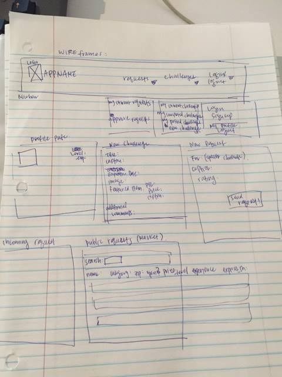

**Grub King**

Ever felt undecided as to what to eat on a boring Tuesday Night (sick of Taco Tuesday are we)? Are you constantly fighting the battle between your inner foodie who desires nothing more than finding the best places to eat in town and your inner child who is constantly raging to find the next best social media game? Look no further! Join Grub King where you can challenge friends to your personal favorite spots and take on challenges as you explore your friends' hot spots as well!

**Technologies:**

MEAN stack (Mongodb, Express, Angular, Node.js)

**Trello**

https://trello.com/b/XITAARSp/project-4-wdi

**Approach Taken**

Set up users model first for authentication/authorization. Added user, challenge, request model to back end. Wired up challenges to interact properly with front end. Added search functionality using yelp fusion's API. Reworked front end for challenges model. Currently working on adding full CRUD to challenges model for front end (back end already configured). Cheers!

**Known Bugs**

Location address not passed properly to back end

Cannot search if certain fields are left blank

**Coming Soon**

Filter search by categories (like ascending by price)

Add full CRUD for challenges

Add expiration functionality to challenges

Requests Model!

Friends Model!

Better Style!

**ERD/WireFrames:**

**Installation Instructions**

Clone this repository into your environment. Run npm install with node. Port to localhost:3000.